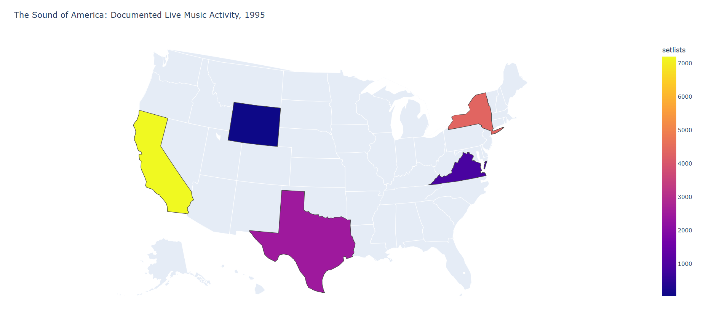

## Overview

This is a **pitch draft**, not a locked project plan. The goal is to show one possible direction for our final Dash project while leaving room for the team to change the questions, features, visualizations, data sources, or scope before we commit.

::: {.callout-note}
## 🎵 Working Vision

**What if we could watch America's musical landscape change?**

*The Sound of America* would be an interactive music-data dashboard that lets users explore **where live music happens, how hit music changes over time, and which artists have the greatest staying power.**

The centerpiece would be an interactive U.S. map that changes as the user changes the **year, genre, or metric**.
:::

---

## Team

**Team name:** *Team One*

**Members:** *Christian Fannell, Tracy Frey, Sean McElwain, Anastasia Stoltz*

---

# 1. The Big Idea

Rather than building three unrelated music charts, the app would tell one larger story:

> **How does American music change across place, time, and artists?**

Each page would answer a different version of that question.

### 🗺️ PLACE
**Where is different music happening?**

### 🎵 TIME
**How has the definition of a hit changed?**

### 🎤 ARTISTS
**Who has actually had staying power?**

---

# 2. What Would the App Feel Like?

The home page could introduce the project and provide three large navigation choices.

::: {.callout-tip}
# THE SOUND OF AMERICA

### Explore America's music across place, time, and genre.

🗺️ **MUSIC ACROSS AMERICA**  
*Watch the geography of live music change.*

🎵 **ANATOMY OF A HIT**  
*See how hit music has evolved.*

🎤 **STAYING POWER**  
*Find the artists who really lasted.*
:::

---

# 3. Page 1 — Music Across America

## The question

> **How has the geography of America's live music changed over time?**

This would be the main visual centerpiece of the project.

Possible controls:

- Year
- Genre
- Metric

Possible metrics:

- Documented live events
- Events per capita
- Genre share

The main visualization would be a U.S. choropleth map.

---

# 4. Proof of Concept

We already tested the idea using Setlist.fm data and successfully created a Plotly U.S. choropleth.

### 1995 test data

| State | Documented Setlists |
|---|---:|
| California | 7,211 |
| New York | 4,353 |
| Texas | 2,481 |
| Virginia | 900 |
| Wyoming | 45 |

The prototype successfully colored the states according to these values.

**This means the map is not just hypothetical — we already have a working proof of concept.**

{fig-align="center" width="85%"}

---

# 5. Page 2 — Anatomy of a Hit

## The question

> **How have America's hit songs changed across generations?**

Possible user controls:

- Decade
- Year range
- Artist
- Genre
- Chart performance

Possible visualizations:

- Scatterplot
- Time series
- Faceted comparison
- Ranked bar chart

Possible questions:

- Are hit songs getting shorter?
- Do songs stay on the charts longer now?
- Are collaborations more common?
- Which genres dominate different eras?

---

# 6. Page 3 — Staying Power

## The question

> **Which artists have had the greatest staying power?**

Possible measures:

- Number of distinct hits
- Total chart weeks
- Top 10 hits
- Number-one hits
- Career span

We could create our own:

## 🎤 Staying Power Score

A stretch feature could let users adjust the weights for longevity, hit count, and chart success.

---

# 7. Data Sources

## Setlist.fm API

Purpose:

- Historical concerts
- Artist
- Venue
- City
- State
- MusicBrainz artist ID

Historical testing showed strong coverage across several states and decades.

## MusicBrainz API

Purpose:

- Genre enrichment
- Artist metadata
- Tags

Examples from our test:

- Home Free → Country
- Desolus → Thrash Metal
- Rose Royce → Disco / Funk / R&B / Soul
- Darius Rucker → Country / Pop / Rock

## Billboard Historical Data

Purpose:

- Hit-song analysis
- Artist longevity
- Chart performance

## Census Population Data

Possible purpose:

- Normalize concert activity per capita

---

# 8. Data Challenges

Real issues we have already found:

- Missing genres
- Artists with multiple genres
- Very specific subgenres
- API rate limits
- Large result sets
- Search results capped at 10,000+
- Need for artist and genre cleaning

These give us meaningful data-cleaning and transformation work to document.

---

# 9. Why This Fits the Assignment

- [x] Multi-page Dash app
- [x] 3 analytical pages plus a home page
- [x] 4+ meaningful callbacks
- [x] 2+ distinct visualizations
- [x] External API and CSV data
- [x] User controls
- [x] Data cleaning
- [x] Real analytical questions
- [x] Strong visual centerpiece
- [x] Stretch potential

---

# 10. Questions for the Team

1. Do we like the overall music concept?
2. Are these the three questions we want to answer?
3. Should the map be the centerpiece?
4. Which genres should we compare?
5. Should the map use raw totals, per-capita activity, or genre share?
6. What should Page 2 focus on?
7. Would we enjoy creating a Staying Power Score?
8. What should we add, remove, or change?

::: {.callout-important}
## The pitch in one sentence

**The Sound of America would let users watch American music change across the map, investigate how hit music evolves across generations, and discover which artists truly have staying power.**
:::